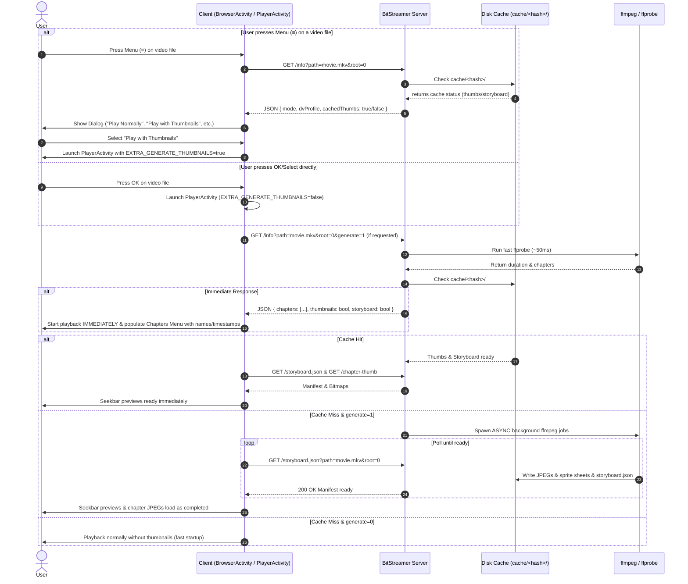

# Chapter & Seekbar Thumbnails — Architecture & Implementation Plan

> [!NOTE]
> Single-file chapter thumbnails and scrubbing previews (storyboards) are implemented. This document details the architectural plan to add **Folder Mode Thumbnails**, expand **Remote `KEYCODE_MENU` Options**, and **Revamp Thumbnail Caching to be 100% Persistent** across all server runs.

---

## 1. Feature Overview & Goals

1. **Persistent Cache Revamp (Single-File & Folder Modes)**:
   - Make all chapter JPEGs and seekbar storyboard sprite sheets **permanently persistent** under the `cache/` directory across server restarts.
   - Key every cache directory by a unique hash of the file's canonical path, size, and modification timestamp: `SHA256(path + size + mtime)[:16]`.
   - Never wipe cached thumbnails on exit — if a file has been processed previously, its thumbnails and seekbar previews are instantly available on subsequent playbacks.

2. **Immediate `ffprobe` Metadata & Chapter Return (Fast Startup)**:
   - `ffprobe` extracts container metadata, stream colorspace, duration, and the full `chapters` array (names + timestamps) in ~50ms.
   - `/info` **returns immediately** with the full `chapters` list so playback starts without delay and the Chapters menu in `PlayerActivity` is available instantly at playback start (with names and timestamps).
   - Chapter thumbnail JPEGs and seekbar sprite sheets generate asynchronously in the background. The Chapters UI shows text/placeholders instantly and fills in thumbnail JPEGs as they finish.

3. **Automatic Cache Re-use**:
   - When playing any video file in single-file or folder mode (even via a standard `OK`/`SELECT` press without selecting special options), the server checks if `cache/<file_hash>/` already contains generated thumbnails and storyboards.
   - If present: automatically enable chapter thumbnails and seekbar scrubbing previews for that playback session.
   - If absent: start playback immediately without thumbnail generation (fast startup, zero CPU load).

4. **Expanded Remote `KEYCODE_MENU` (≡ Options Menu)**:
   - Allow pressing **Menu (≡)** on **ALL playable video files** in `DiscoveryActivity` and `BrowserActivity` (not just Dolby Vision files).
   - Interrogate the server's cache status via `/info` to show dynamic options:
     - `Play Normally`: Starts playback. Uses cached thumbnails if available; otherwise plays cleanly without thumbnail generation.
     - `Play with Thumbnails` *(or `Play with Thumbnails [Cached]`)*: Forces thumbnail & seekbar storyboard availability. If not yet in cache, triggers background `ffprobe`/`ffmpeg` generation on the server.
     - `Strip DV and Play` *(for Dolby Vision Profile 7 files)*: Forces HEVC/HDR10 fallback. Uses cached thumbnails if available.
     - `Strip DV & Play with Thumbnails` *(for Dolby Vision Profile 7 files)*: Forces HEVC/HDR10 fallback and triggers background thumbnail generation.

5. **Background Server Generation in Folder Mode**:
   - When "Play with Thumbnails" is requested for a file in folder mode, the server executes `ffprobe` (to read duration and chapters) and `ffmpeg` (to generate chapter thumbnails and seekbar sprite sheets) in the background for that specific file, using the exact same pipeline as single-file mode.
   - The client polls `/storyboard.json` during playback and enables the seekbar scrubbing preview as soon as generation completes.

---

## 2. Persistent Cache Architecture

### Cache Directory Structure

```text
server/cache/
├── <file_hash_1>/
│   ├── metadata.json           # Cached ffprobe JSON (duration, chapters, colour transfer, dvProfile)
│   ├── thumbs/                 # Chapter thumbnails
│   │   ├── thumb_000.jpg
│   │   └── thumb_001.jpg
│   └── storyboard/             # Seekbar scrubbing preview sprite sheets
│       ├── storyboard.json     # Manifest (intervalMs, tileW, tileH, cols, rows, tileCount)
│       ├── sheet_000.jpg
│       └── sheet_001.jpg
└── <file_hash_2>/
    ...
```

### Cache Key Formula

```go
func fileCacheHash(path string, size int64, modTime time.Time) string {
    h := sha256.New()
    fmt.Fprintf(h, "%s:%d:%d", filepath.Clean(path), size, modTime.UnixNano())
    return hex.EncodeToString(h.Sum(nil))[:16]
}
```

- **Persistence**: Cache directories persist across server runs.
- **Cache Check (`hasCache`)**:
  - `hasCachedThumbs(hash)`: `true` if `cache/<hash>/thumbs/` exists and contains JPEGs for all chapters.
  - `hasCachedStoryboard(hash)`: `true` if `cache/<hash>/storyboard/storyboard.json` exists and sprite sheets are complete.

---

## 3. Server-Side Changes (`server/`)

### A. Immediate Metadata vs Async Thumbnail Generation

- `ffprobe` is executed synchronously during `/info` (~50ms execution time). It populates the `chapters` array (`[{ startMs, name }]`) in the JSON response immediately.
- `ffmpeg` thumbnail & storyboard generation runs in an asynchronous background goroutine (`go generateAsync(file)`).
- As each chapter thumbnail JPEG finishes writing to `cache/<hash>/thumbs/thumb_XXX.jpg`, subsequent HTTP requests for `/chapter-thumb?index=XXX` serve the image immediately.

### B. New & Updated Endpoints

| Endpoint | Query Parameters | Description |
|---|---|---|
| `GET /info` | `path=<rel>&root=<N>&generate=<0\|1>` | Returns metadata + `chapters` array **immediately**. If `generate=1` is passed and thumbnails are not cached, triggers background `ffmpeg` generation. Includes `cachedThumbs: bool`, `cachedStoryboard: bool`, `thumbnails: bool`, `storyboard: bool`. |
| `GET /chapter-thumb` | `path=<rel>&root=<N>&index=<I>` | Serves chapter thumbnail `I` for the file at `path` within root `N` (reads from `cache/<hash>/thumbs/`). Returns 404 / 202 if still generating. |
| `GET /storyboard.json` | `path=<rel>&root=<N>` | Serves `storyboard.json` manifest for the file at `path` within root `N`. |
| `GET /storyboard` | `path=<rel>&root=<N>&sheet=<S>` | Serves sprite sheet `S` for the file at `path` within root `N`. |
| `POST /generate-thumbnails` | `path=<rel>&root=<N>` | Triggers background `ffprobe` chapter/duration probe and `ffmpeg` thumbnail & storyboard generation for `path`. |

### C. On-Demand Generator (`server/folder_generator.go`)

- Maintain a thread-safe map of active background generation jobs: `map[string]*fileJob`.
- When `generate=1` or `POST /generate-thumbnails` is called for a file:
  1. If already cached → returns `200 OK` immediately (`cached: true`).
  2. If job in progress → attaches to existing job (no duplicate `ffmpeg` processes).
  3. If new job → spawns background goroutine:
     - Runs `ffprobe` to extract duration and chapters.
     - Pre-generates chapter JPEGs to `cache/<hash>/thumbs/`.
     - Runs `ffmpeg` keyframe-seek sprite sheet generator to `cache/<hash>/storyboard/`.
     - Writes `storyboard.json` manifest on completion.

---

## 4. Client-Side Changes (`client/`)

### A. Options Menu Revamp (`BrowserActivity.kt` & `DiscoveryActivity.kt`)

1. **Menu Key Interception (`onKeyDown`)**:
   - Allow **Menu (≡)** on any entry where `isPlayable(entry.name)` is `true`.

2. **Cache-Aware Dialog Construction**:
   - Before displaying the dialog, make a quick background `/info` request to check cache status.
   - Render menu options dynamically:

```text
┌──────────────────────────────────────────┐
│ Movie.Title.2026.mkv                     │
├──────────────────────────────────────────┤
│  Play Normally                           │
│  Play with Thumbnails [Cached]           │  <-- if already in cache
│  Strip DV and Play                       │  <-- if Dolby Vision
│  Strip DV & Play with Thumbnails         │  <-- if Dolby Vision
└──────────────────────────────────────────┘
```

3. **Intent Extras**:
   - Passing `EXTRA_GENERATE_THUMBNAILS = true` when user selects `Play with Thumbnails` or `Strip DV & Play with Thumbnails`.

### B. Player Activity Integration (`PlayerActivity.kt`)

1. **Metadata Query with Thumbnail Intent**:
   - In `onStart()`, when fetching `/info`:
     - If `EXTRA_GENERATE_THUMBNAILS` is `true`, append `&generate=1` to the `/info` request.
2. **Immediate Chapter List Availability**:
   - `info.chapters` is received instantly in `/info`. The Chapters selector menu displays immediately with chapter titles and timestamps.
   - If chapter thumbnail bitmaps are not yet ready from `/chapter-thumb?index=N`, `ChapterThumbnailLoader` shows placeholders / text until JPEGs arrive.
3. **Auto-Detection of Cached Thumbnails**:
   - If `/info` response has `"thumbnails": true` or `"storyboard": true` (whether cached previously or triggered now), set `hasThumbnails = true` and `storyboardEnabled = true`.
4. **Storyboard Polling in Folder Mode**:
   - If `storyboardEnabled` is `true` (or background generation is in progress), poll `/storyboard.json?path=...&root=N` periodically until ready, then attach `StoryboardLoader` to the seekbar.

---

## 5. Sequence Diagram



---

## 6. Detailed Action Plan & Checklist

### Phase 1: Server Caching Architecture Refactor
- [ ] Create persistent hash keying helper `fileCacheHash(path, size, mtime)` in `server/cache.go`.
- [ ] Update `thumbnails.go` and `storyboard.go` to store files in `cache/<file_hash>/thumbs/` and `cache/<file_hash>/storyboard/`.
- [ ] Remove automatic directory deletion on server exit in `main.go` so thumbnail cache remains persistent.
- [ ] Add cache validation helper functions: `hasCachedThumbs(hash)` and `hasCachedStoryboard(hash)`.

### Phase 2: Server On-Demand & Folder Mode Endpoints
- [ ] Implement immediate `/info` metadata return with fast `ffprobe` parsing.
- [ ] Implement `POST /generate-thumbnails` and update `writeFolderInfo` in `server.go` to accept `?generate=1`.
- [ ] Implement folder-mode parameter handling (`path=<rel>&root=<N>`) for `/chapter-thumb`, `/storyboard.json`, and `/storyboard`.
- [ ] Add background job deduplication so multiple requests for the same file share the same `ffmpeg` generation process.

### Phase 3: Client Menu & UI Integration
- [ ] Update `onKeyDown(KEYCODE_MENU)` in `DiscoveryActivity.kt` and `BrowserActivity.kt` to trigger for all video files.
- [ ] Add background `/info` cache check before displaying the dialog to show cache status tags (e.g. `[Cached]`).
- [ ] Add `Play with Thumbnails` and `Strip DV & Play with Thumbnails` options to the `AlertDialog`.
- [ ] Pass `EXTRA_GENERATE_THUMBNAILS` extra in the launch `Intent` to `PlayerActivity`.

### Phase 4: Client Player Integration
- [ ] Update `PlayerActivity.kt` `onStart()` to pass `&generate=1` to `/info` when `EXTRA_GENERATE_THUMBNAILS` is `true`.
- [ ] Display `info.chapters` immediately in the Chapters menu with titles and timestamps (using placeholders for thumbnail JPEGs while generating).
- [ ] Update `PlayerActivity.kt` to auto-enable chapter thumbnails and seekbar storyboards whenever `/info` indicates `"thumbnails": true` or `"storyboard": true`.
- [ ] Update `storyboard` polling logic in `PlayerActivity.kt` to support folder-mode query parameters (`?path=...&root=N`).
- [ ] Update `playAt(index)` in `PlayerActivity.kt` to carry forward `EXTRA_GENERATE_THUMBNAILS` during folder playlist navigation.

### Phase 5: Verification & Testing
- [ ] Verify single-file mode continues to generate and re-use persistent thumbnails across server restarts.
- [ ] Verify folder mode displays Menu options on all video files.
- [ ] Verify fast `ffprobe` metadata return allows Chapters menu to open immediately upon playback start.
- [ ] Verify pressing "Play with Thumbnails" generates chapter and seekbar previews in folder mode asynchronously.
- [ ] Verify playing a previously cached file automatically loads chapter thumbnails and seekbar previews without re-running `ffmpeg`.
- [ ] Verify Dolby Vision Profile 7 + thumbnail options combination (`Strip DV & Play with Thumbnails`).

---

## What shipped

- Server (`thumbnails.go`): detects `ffmpeg` next to the exe or on `PATH`; if present,
  `GET /chapter-thumb?index=N` returns a JPEG generated on first request (`ffmpeg -ss
  <start+5s> -i file -frames:v 1 -vf scale=320:-2 -f mjpeg`), cached to
  `cache/thumbs/` next to the executable, keyed by file+mtime+hdr+index, concurrency capped at 3.
  `/info` reports `"thumbnails": true` only when ffmpeg is available.
- Client: `ChapterThumbnailLoader` fetches `/chapter-thumb?index=N` over HTTP and caches
  the bitmaps. When `/info` says `thumbnails:false`, the chapter selector hides the image
  and shows a compact name + timestamp list.
- ffmpeg is a **user-supplied sidecar** (not bundled): drop `ffmpeg.exe` next to
  `bitstreamer.exe` to enable thumbnails; without it, everything else works unchanged.
- **HDR tonemapping**: HDR sources are tonemapped BT.2020→BT.709 with ffmpeg's
  `zscale`/`tonemap` filters (`ffmpeg.go`) so thumbnails aren't washed out — for both
  chapter thumbnails and storyboard tiles. Detection is via **ffprobe** (`probe.go`),
  which reads the real stream's colour transfer (PQ/HLG) and the Dolby Vision profile;
  it falls back to the MKV container tags (`hdr.go`) if ffprobe isn't present. Works for
  HDR10, HDR10+, and Dolby Vision profiles with a PQ/HLG base (7/8.x); DV **profile 5**
  can't be colour-accurate without DV RPU processing (an ffmpeg/libplacebo limitation).
  If the ffmpeg build lacks `zscale` (libzimg), it falls back to plain extraction (washed
  out, but present) and logs once. The detected colour info is printed at startup.
- **Eager generation**: on startup the server pre-generates all chapter thumbnails in the
  background (`thumbnailer.warm()`, concurrency-capped), so the chapter menu is instant the
  first time it's opened instead of triggering ffmpeg on demand. On-demand generation
  remains as a fallback (a request for a not-yet-warmed chapter shares the same per-index
  lock, so there's no duplicate work).

The rest of this doc records the original investigation and rationale.

---

## Scrubbing preview thumbnails (YouTube/Netflix-style "storyboard")

Status: **implemented.** As you drag the seek bar, a small preview of the frame at that
position follows the thumb — a "trickplay"/"storyboard" preview. Unlike chapter thumbnails
(one per chapter), this needs a **dense, regular grid** of frames across the whole movie.

What shipped (matching the design below): server `storyboard.go` generates sprite sheets at
startup via ffmpeg into `cache/storyboard/` next to the executable (wiped at start and on
Ctrl+C/SIGTERM — per-session), duration comes
from ffprobe (`mediaDurationMs` in `duration.go`), and `/storyboard.json` + `/storyboard?sheet=N` serve the
manifest and sheets. The interval is the **`--interval <secs>` flag (default 30)**. The
client (`StoryboardLoader` + the scrub overlay in `PlayerActivity`) fetches sheets, decodes the
tile for the scrub position, and shows it; it also sets the seek-bar D-pad step to the same
interval so each left/right press lands on the next preview frame (and fixes the old
"jumps several minutes" behavior). If the server is still generating when a movie opens, the
client polls `/storyboard.json` and enables previews once ready.

### How mature players do it (and we should too): sprite sheets

Jellyfin/Emby/Plex all use the same trick — don't store thousands of tiny files, store a
few **sprite sheets**: big images that tile many small frames in a grid, plus a manifest
describing the interval and tile layout. The client crops the right tile for the scrub
position. ffmpeg produces these in one pass:

```
ffmpeg -i <file> -vf "fps=1/<T>,scale=240:-2,tile=10x10" -q:v 5 <cache>/sb_%03d.jpg
```

- `fps=1/T` samples one frame every `T` seconds (e.g. T=10).
- `scale=240:-2` shrinks each frame; `tile=10x10` packs 100 frames per sheet.
- Number of tiles = ceil(duration / T); sheets = ceil(tiles / 100).

### Server

- **Duration**: needed to know how many tiles. Read via `ffprobe -show_entries
  format=duration` (`mediaDurationMs` in `duration.go`) — the same ffprobe sidecar used for
  chapters and HDR detection, so no code path is MKV-specific and any container ffprobe
  understands works.
- **Generation**: at startup, in the background (same as chapter warm), run the ffmpeg
  command above into a **per-session** temp dir. This is the expensive part — see cost.
- **Endpoints**:
  - `GET /storyboard.json` → `{intervalMs, tileW, tileH, cols, rows, tileCount, sheetCount}`.
  - `GET /storyboard?sheet=N` → the Nth sprite-sheet JPEG.
  - `/info` gains `"storyboard": true` when ready.
- **Per-session lifecycle** (as requested): generate on start, **delete the storyboard
  cache dir on shutdown** (Ctrl+C / SIGTERM handler). Chapter thumbnails stay disk-cached
  across runs; the dense storyboard does not (it's large and file-specific).

### Client

- On player start, if `/info` says `storyboard:true`, fetch `/storyboard.json`.
- Attach a scrub listener to the `DefaultTimeBar` (`TimeBar.OnScrubListener.onScrubMove`
  gives the scrubbed position). From position → tile index (`pos/intervalMs`) →
  sheet number + row/col → decode that tile's region out of the (cached) sheet → show it in an
  overlay `ImageView` positioned above the scrubber thumb.
- Cache each sheet's **encoded JPEG bytes** (not the decoded bitmap) in an `LruCache`, and
  decode only the requested tile with a `BitmapRegionDecoder`. Memory stays a few MB no
  matter how large the sheets are — which is what lets the tiles be full-resolution (480px
  wide, 1:1 with the on-screen preview at 240dp/xhdpi) without OOMing the Fire TV Stick.
  A whole-sheet decode would be ~52 MB per 4800×2700 sheet.

### Generation: fast keyframe seeks (not a full decode)

An early version used one `fps` filter pass, which makes ffmpeg **decode the whole video** —
minutes of CPU for a 2-hour 4K file. The shipped version instead does a **fast keyframe seek
per interval**: `ffmpeg -ss <i*interval> -i file -frames:v 1` uses the container index to jump
to the nearest keyframe and decode almost nothing. These run in parallel (capped), then Go
tiles the frames into sprite sheets (`image/draw`, stdlib). For a 2h film at 30s that's ~240
targeted seeks — seconds, not minutes — and every tile is effectively a keyframe.

### Why fixed intervals (not keyframe-driven variable spacing)

Considered letting the keyframes themselves set the spacing (extract *every* I-frame at its
natural position). Rejected — it's worse on every axis that matters here:
- **Slower to generate**, not faster: grabbing all keyframes needs a full-file pass
  (`-skip_frame nokey` still demuxes the whole container and decodes every I-frame, often
  1000s). Targeted seeks at fixed intervals touch far less of the file.
- **Unpredictable, unbounded count**: keyframe density varies wildly by encode; a fast-cut
  film could yield thousands of tiles (dozens of sheets), a static one very few.
- **Complex client**: irregular timestamps break the trivial `tileIndex = time/interval`
  mapping — you'd need a per-tile timestamp manifest and a nearest-tile binary search.
- **Marginal UX gain**: for scrubbing, a fixed grid is plenty; nobody needs a preview at
  every scene cut.

Fixed interval + keyframe seek already gives keyframe-quality frames with fast, bounded,
simple generation. Want finer granularity? Lower `--interval` (e.g. `--interval 10`) — it
stays fast because of the seek approach.

### Effort

Server: duration parse + storyboard generation + 2 endpoints + shutdown cleanup
(~150–200 lines, testable on the Mac with ffmpeg). Client: scrub-listener overlay + tile
cropping + positioning (~150 lines). Medium feature; the startup decode time is the thing
to validate on a real long 4K file before committing.


## Why Option A failed (confirmed on hardware)

The client tried `MediaMetadataRetriever.getScaledFrameAtTime()` over the stream URL — the
device already hardware-decodes the movie, so in theory it can grab frames too. Diagnostics
in `client-logs.txt` (Fire TV Stick 4K Max, AFTKM) showed it does not:

```
thumbnail source: 3840x2160 mime=video/x-matroska
frame at 5000ms: 320x180 avgLum=0 (appears BLACK …)     # 4K HDR  -> black
frame NULL at 5000ms (decoder could not produce a frame) # another file -> null
```

Both failure modes appear, and the user confirms it also fails for 1080p. Root cause: a
Fire TV stick has a **single video hardware decoder**, already in use by playback, so the
retriever's concurrent decode returns black or null frames (HDR/10-bit makes the black case
worse). This is a platform ceiling, not a bug we can code around on the client.

## Plan: extract thumbnails on the server with ffmpeg

The PC has spare CPU and no decoder contention. Generate one thumbnail per chapter there
and serve them; the client just displays images (no on-device decode).

### Server

- **Dependency**: `ffmpeg.exe` as an external sidecar (NOT bundled — see decision below).
  Detect it on `PATH` or next to `bitstreamer.exe`; if absent, log once and serve no
  thumbnails (chapters still work, just without images). This keeps the zero-dependency
  default: users who want thumbnails drop in one `ffmpeg.exe`.
- **Generation** (lazy, on first request, cached to disk): for chapter at time T,
  ```
  ffmpeg -ss <T+5s> -i <file> -frames:v 1 -vf "scale=320:-1" -q:v 4 -f mjpeg <cache>/<hash>_<idx>.jpg
  ```
  `-ss` before `-i` = fast keyframe seek; `-frames:v 1` = one frame. ~50–150 ms each.
  Cache under a temp dir keyed by (file path + mtime + chapter index); reuse across runs.
  Cap concurrency (a small worker pool) so 20 chapters don't spawn 20 ffmpeg processes.
- **Endpoint**: `GET /chapter-thumb?index=N` → the JPEG (200), or 404 if unavailable /
  ffmpeg missing. Optionally warm the cache in the background at startup.
- **/info**: add `"thumbnails": true` when ffmpeg is available, so the client knows whether
  to request them.

### Client

- Replace `ChapterThumbnailLoader` (MediaMetadataRetriever) with a plain HTTP image fetch:
  `GET /chapter-thumb?index=N` → decode JPEG → cache in the existing `LruCache`. The
  `ChapterListAdapter` UI stays exactly the same (it already loads async and shows a
  placeholder until the bitmap arrives).
- If `/info` reports `thumbnails=false`, skip requests and just show name + timestamp.

### Decision to settle at implementation time: bundle ffmpeg or not?

- **Sidecar, user-supplied (leaning this way)**: keep shipping one small `bitstreamer.exe`;
  document "drop `ffmpeg.exe` next to it for chapter thumbnails." Preserves the
  lightweight, single-binary promise; thumbnails are opt-in.
- **Bundle ffmpeg** (~80–100 MB): thumbnails work out of the box, but the download balloons
  and it contradicts the project's lightweight premise.

Recommendation: sidecar. Revisit only if the manual step proves annoying in practice.

### Effort

Server: ffmpeg detection + generation + cache + endpoint (~150 lines, testable on the Mac
where ffmpeg is already installed). Client: swap the loader's internals (~40 lines), no UI
change. Half a focused session.

### Not doing

Sprite sheets / scrubbing-preview thumbnails (one image strip for hover-scrub) — larger
feature; per-chapter stills are enough for the chapter selector.
