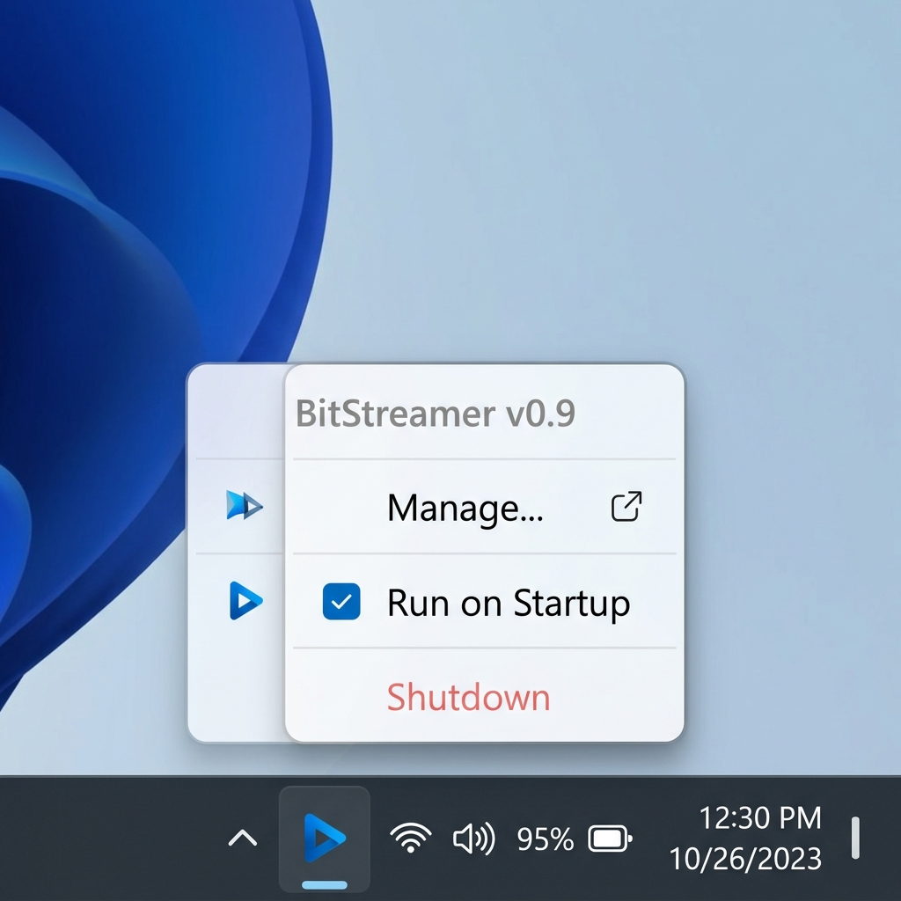
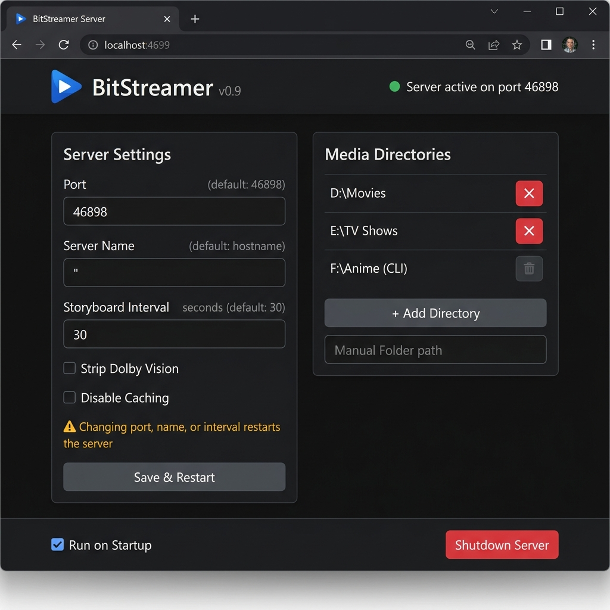

# BitStreamer Server — Background Process with System Tray Control

## Goal

Run the BitStreamer server as a **background process** controlled from a **system tray icon**
(Windows notification area / macOS menu bar / Linux StatusNotifierItem). When launched
(double-click or command line) the server starts silently in the background; interaction
happens through a right-click context menu on the tray icon and a browser-based management
page. **One codebase, one binary per platform, no platform-specific GUI code.**

---

## Current State

| Area | Today |
|------|-------|
| Entry point | `main.go` — CLI with `flag` parsing, prints to stdout, blocks on `http.ListenAndServe` |
| Multi-root | Supported via multiple CLI positional args (e.g. `bitstreamer D:\Movies E:\Shows`) |
| Config persistence | None — dirs come from CLI args only, lost on restart |
| Window subsystem | Console app (`go build` default) — always opens a terminal |
| Icon asset | `client/app/src/main/res/drawable-nodpi/app_icon.png` (512×512 PNG); also `icon2.png` at repo root |
| Dependencies | Go stdlib only (no cgo, no third-party modules) |

---

## Design

### 1. System-Tray Icon (Cross-Platform)

Use **[`github.com/getlantern/systray`](https://github.com/getlantern/systray)**
(pure Go, no cgo, MIT licence). It supports **all three platforms** from a single API:

| Platform | Mechanism | Status |
|----------|-----------|--------|
| **Windows** | `Shell_NotifyIconW` (notification area) | ✅ Rock solid |
| **macOS** | `NSStatusItem` (menu bar) | ✅ Works great |
| **Linux** | `StatusNotifierItem` via D-Bus (X11 `XEmbed` fallback) | ⚠️ Works on KDE, XFCE, MATE; GNOME needs AppIndicator extension |

- Provides a tray/menu-bar icon, right-click context menu with items, checkboxes, separators
- Click-channel per item — idiomatic Go
- One import, one API, one binary — no `//go:build` platform splits for the tray layer

> [!IMPORTANT]
> **This is the first third-party Go module in the server.** The project convention
> (`CLAUDE.md`) is stdlib-only with a "needs a written reason" escape hatch. The reason:
> there is no stdlib API for system tray icons on any platform; the module is small, pure
> Go, and does exactly one thing.

#### Icon Format

Windows system tray requires `.ico` format. We will:

1. Convert `app_icon.png` → `icon.ico` (multi-resolution: 16×16, 32×32, 48×48, 256×256)
   at build time or check in a pre-built `.ico`.
2. Embed the `.ico` into the binary with `go:embed` so the single-exe story is preserved.

#### Build Flag: `-ldflags "-H windowsgui"`

To suppress the console window on Windows, the build must use:
```
go build -ldflags "-H windowsgui" -o ../dist/bitstreamer.exe .
```
This sets the PE subsystem to GUI so double-clicking won't spawn a terminal. Logs go to
the existing `server.log` file (already implemented in `initServerLog`).

---

### 2. Right-Click Context Menu (All Platforms)

The same menu appears on Windows (notification area), macOS (menu bar), and Linux (tray):

```
┌──────────────────────────┐
│  BitStreamer v0.x         │  (disabled/info label)
│ ─────────────────────────│
│  Manage…                 │  → opens /_manage in default browser
│ ─────────────────────────│
│  ☐ Run on Startup        │  → toggle (checkbox)
│ ─────────────────────────│
│  Shutdown                │  → graceful exit
└──────────────────────────┘
```

#### Menu items

| Item | Type | Behaviour |
|------|------|-----------|
| **BitStreamer v0.x** | Disabled label | Shows version; non-interactive |
| **Manage…** | Click | Opens `http://localhost:<port>/_manage` in the default browser |
| **Run on Startup** | Checkbox toggle | Registers/unregisters auto-start (see §5) |
| **Shutdown** | Click | Graceful server shutdown (`http.Server.Shutdown`) then `systray.Quit` |

> [!NOTE]
> "Manage…" opens the browser — no native GUI windows needed. The management page is served
> by the existing HTTP server, keeping the codebase platform-agnostic.

**Design mockup (System Tray Menu):**



---

### 3. Manage Page — Embedded HTML UI (`/_manage`)

The management interface is an **HTML page served by the existing HTTP server** at
`http://localhost:<port>/_manage`. It communicates with the server via a small JSON REST
API. The HTML/CSS/JS is embedded into the binary with `go:embed`.

#### Why HTML?

- **Zero native GUI deps** — no platform-specific window code, no cgo, no GUI toolkit
- **Single codebase** — one HTML page works identically on Windows, macOS, and Linux
- **Already have an HTTP server** — no new infrastructure, just new routes
- **Rich UI** — tabs, lists, toggles, folder input, toast notifications — trivial in HTML/CSS/JS
- **~50 KB** embedded (HTML + CSS + JS, minified) — negligible binary size impact

#### How it opens

When the user clicks **"Manage…"** in the tray menu, the server runs:

```go
// openBrowser opens the manage page in the user's default browser.
func openBrowser(port int) {
    url := fmt.Sprintf("http://localhost:%d/_manage", port)
    switch runtime.GOOS {
    case "windows":
        exec.Command("rundll32", "url.dll,FileProtocolHandler", url).Start()
    case "darwin":
        exec.Command("open", url).Start()
    default:
        exec.Command("xdg-open", url).Start()
    }
}
```

On Linux where the tray might not appear, the page is also opened automatically on startup.

---

#### 3a. REST API Endpoints

All endpoints are on the existing HTTP server (port 46898 by default).

| Method | Path | Request Body | Response | Purpose |
|--------|------|-------------|----------|---------|
| `GET` | `/_manage` | — | HTML page | Serves the embedded management UI |
| `GET` | `/_api/config` | — | `Config` JSON | Returns current config + runtime state |
| `PUT` | `/_api/config` | `Config` JSON | `{"ok":true}` or `{"error":"..."}` | Saves settings; triggers restart if needed |
| `GET` | `/_api/dirs` | — | `{"dirs":[...], "cli_dirs":[...]}` | Returns served dirs (config + CLI) |
| `POST` | `/_api/dirs` | `{"path":"..."}` | `{"ok":true}` or `{"error":"..."}` | Adds a directory (validates, hot-adds) |
| `DELETE` | `/_api/dirs` | `{"path":"..."}` | `{"ok":true}` or `{"error":"..."}` | Removes a config directory (not CLI dirs) |
| `GET` | `/_api/status` | — | `{"version":"...","port":...,"dirs":...,"uptime":...}` | Server status for the UI header |
| `GET` | `/_api/startup` | — | `{"enabled":true/false}` | Is "Run on Startup" enabled? |
| `PUT` | `/_api/startup` | `{"enabled":true/false}` | `{"ok":true}` | Toggle auto-start |

> [!NOTE]
> All `/_api/*` and `/_manage` routes are bound to `localhost` only — they never respond to
> requests from other machines on the LAN. The existing media-serving routes (port 46898)
> continue to serve all interfaces.

---

#### 3b. HTML Page Layout

A single-page app with two sections (shown as tabs or stacked panels):

```
┌─── BitStreamer — Manage ──────────────────────────────────────┐
│                                                              │
│  BitStreamer v0.x  ·  ● Running on port 46898                │
│                                                              │
│  ┌─ Server Settings ──────────────────────────────────────┐  │
│  │                                                        │  │
│  │  HTTP Port          [ 46898          ]  (default: 46898)│  │
│  │  Server Name        [                ]  (default: hostname)│
│  │  Preview Interval   [ 30             ]  sec (default: 30)│  │
│  │                                                        │  │
│  │  ☐ Strip Dolby Vision       ☐ Disable Caching          │  │
│  │                                                        │  │
│  │  ⚠ Changing port, name, or interval restarts the server│  │
│  │                                                        │  │
│  │  [ Save & Restart ]  (disabled until something changes)│  │
│  └────────────────────────────────────────────────────────┘  │
│                                                              │
│  ┌─ Media Directories ────────────────────────────────────┐  │
│  │                                                        │  │
│  │  D:\Movies                                        [✕]  │  │
│  │  E:\TV Shows                                      [✕]  │  │
│  │  F:\Anime                              (CLI)      [—]  │  │
│  │                                                        │  │
│  │  [ + Add Directory… ]                                  │  │
│  │                                                        │  │
│  │  Dirs passed via command line are marked (CLI)          │  │
│  │  and cannot be removed from this page.                  │  │
│  └────────────────────────────────────────────────────────┘  │
│                                                              │
│  ☐ Run on Startup                          [ Shutdown ]     │
│                                                              │
└──────────────────────────────────────────────────────────────┘
```

**Design mockup (Browser Management Dashboard Page):**



#### 3c. Folder Picker

HTML5's `<input type="file" webkitdirectory>` allows folder selection in Chrome, Edge, and
Firefox. When the user clicks "+ Add Directory…", a standard OS folder-browse dialog opens
via the browser. The selected folder path is sent to `POST /_api/dirs`.

> [!WARNING]
> `webkitdirectory` gives relative paths in some browsers for security reasons. As a
> fallback, we can provide a text input where the user types/pastes the absolute path.
> Both options are shown: a "Browse…" button (uses `webkitdirectory`) and a text input
> with an "Add" button for manual entry.

---

#### 3d. Configurable Settings

| Setting | Config key | CLI flag | Default | Restart? |
|---------|-----------|----------|---------|----------|
| HTTP Port | `port` | `--port` | `46898` | **Yes** — rebinds listener |
| Server Name | `display_name` | `--name` | `""` (= hostname) | **Yes** — re-announces via discovery |
| Preview Interval | `interval` | `--interval` | `30` (seconds) | **Yes** — affects storyboard generation |
| Strip Dolby Vision | `strip_dv` | `--stripdv` | `false` | No — per-request flag |
| Disable Caching | `no_caching` | `--no-caching` | `false` | No — per-request flag |

#### 3e. Restart Logic

When the user clicks **"Save & Restart"** and a restart-requiring setting changed:

1. Browser sends `PUT /_api/config` with the new values.
2. Server saves updated values to `config.json`.
3. Server responds `{"ok":true, "restarting":true}`.
4. Server gracefully shuts down the HTTP listener (`http.Server.Shutdown`).
5. Stops the UDP discovery goroutine.
6. Rebuilds the `app` struct with the new configuration.
7. Starts new HTTP server + discovery goroutines (potentially on a new port).
8. Updates the tray tooltip with the new port/name.
9. Logs the restart to `server.log`.

This is an **in-process restart** — no need to re-exec the binary. The systray icon stays
put; only the server internals are torn down and rebuilt.

For non-restart settings (strip DV, caching), the change is applied immediately to the
live `app` struct and saved to `config.json` — no restart needed. The API responds
`{"ok":true, "restarting":false}`.

> [!NOTE]
> If the port changes, the browser tab's URL becomes stale. The HTML page detects the
> restart response and shows a "Server restarting on port XXXXX…" message with a link to
> the new URL. The page polls the new port until it's up, then redirects automatically.

> [!NOTE]
> If the new port is already in use, the restart fails. The API responds with
> `{"ok":false, "error":"port 8080 is already in use"}` and the server stays on the old
> port. The HTML page shows the error as a toast notification.

---

#### Hot-adding Directories

The `app` struct's `roots []rootEntry` slice is currently set once at startup. We will add
a `sync.RWMutex` and methods:

```go
func (a *app) AddRoot(dir string) error   // validates, appends to roots, saves config
func (a *app) RemoveRoot(dir string) error // removes from roots, saves config
func (a *app) Roots() []rootEntry          // returns a snapshot (read-locked)
```

The HTTP handler already iterates `app.roots` per request, so adding a read-lock there and
a write-lock in Add/Remove is sufficient. Adding/removing directories does **not** require
a server restart — it's a live hot-reload.

---

### 4. `config.json` — Persistent Configuration

Stored next to the executable (alongside `server.log`, `resume.json`, etc.):

```jsonc
{
  "directories": [
    "D:\\Movies",
    "E:\\TV Shows"
  ],
  "run_on_startup": true,
  "port": 46898,
  "display_name": "",
  "interval": 30,
  "strip_dv": false,
  "no_caching": false
}
```

#### Rules

| Field | Default | Notes |
|-------|---------|-------|
| `directories` | `[]` | Dirs added via the **Manage** modal only. CLI args are merged at runtime but not saved here |
| `run_on_startup` | `false` | Mirrors the tray/menu checkbox state |
| `port` | `46898` | HTTP port. Changing requires restart |
| `display_name` | `""` (= hostname) | Discovery name. Changing requires restart |
| `interval` | `30` | Storyboard preview interval in seconds. Changing requires restart |
| `strip_dv` | `false` | Mirrors the `--stripdv` flag. Live change, no restart |
| `no_caching` | `false` | Mirrors the `--no-caching` flag. Live change, no restart |

#### Load/Save

```go
type Config struct {
    Directories  []string `json:"directories"`
    RunOnStartup bool     `json:"run_on_startup"`
    Port         int      `json:"port,omitempty"`
    DisplayName  string   `json:"display_name,omitempty"`
    Interval     int      `json:"interval,omitempty"`
    StripDV      bool     `json:"strip_dv,omitempty"`
    NoCaching    bool     `json:"no_caching,omitempty"`
}

func loadConfig(path string) (*Config, error)
func (c *Config) save(path string) error
```

- `loadConfig` reads and unmarshals; returns defaults if the file doesn't exist.
- `save` writes atomically (write to `config.json.tmp`, rename).
- CLI flags, when explicitly set, **override** config.json values for that run.
- Dirs from CLI args are **merged** with dirs from config.json (union, no duplicates).
- Settings changes from the UI are saved to config.json and take effect on restart
  (for port/name/interval) or immediately (for strip_dv/no_caching).

---

### 5. Run on Startup (Per-Platform)

Controlled via the tray checkbox **and** the `/_manage` page's "Run on Startup" checkbox.
Both call the same `/_api/startup` endpoint.

#### Interface

```go
func isRunOnStartup() bool        // reads the platform-specific auto-start config
func setRunOnStartup(enable bool) // creates or removes it
```

These are the **only** platform-specific functions in the codebase (behind `//go:build` tags).

#### Windows — Registry Run key

```
HKCU\Software\Microsoft\Windows\CurrentVersion\Run
  BitStreamer = "C:\path\to\bitstreamer.exe"
```

Uses raw `syscall` `RegOpenKeyEx`/`RegSetValueEx` (no extra deps).

#### macOS — LaunchAgent plist

```
~/Library/LaunchAgents/com.bitstreamer.server.plist
```

A standard launchd plist. Written/removed by `setRunOnStartup`. No root privileges needed.

#### Linux — XDG autostart

```
~/.config/autostart/bitstreamer.desktop
```

A standard `.desktop` entry. Works on GNOME, KDE, XFCE, and most desktop environments.

When enabled, the exe path is written as-is (no CLI arguments needed — dirs and settings
come from `config.json`). The tray checkbox state is synced on startup by reading
`isRunOnStartup()`.

---

### 6. Startup Flow (Revised `main()`)

```
main()
  ├─ Parse flags (keep existing flag.Parse for backward compat)
  ├─ Load config.json
  ├─ Merge: config dirs ∪ CLI-arg dirs → effective roots
  ├─ If no dirs at all → start with empty roots (server runs, client sees nothing until dirs added)
  ├─ Build the app (newMultiRootApp or empty-root variant)
  ├─ Register /_manage and /_api/* routes on the HTTP handler
  ├─ Start HTTP server in goroutine
  ├─ Start UDP discovery in goroutine
  ├─ systray.Run(onReady, onQuit)      ← blocks on the message loop
  │     onReady:
  │       Set icon (embedded .ico / .png)
  │       Set tooltip "BitStreamer — serving N dirs on port XXXXX"
  │       Build menu items (Manage…, Run on Startup, Shutdown)
  │       Manage… click → openBrowser(port)  // opens /_manage in browser
  │       On Linux: also auto-open browser if tray failed to register
  │     onQuit:
  │       http.Server.Shutdown(ctx)
  │       save config
  └─ os.Exit(0)
```

> [!IMPORTANT]
> `systray.Run` takes over the main thread (it runs the OS message pump). The HTTP
> server and discovery must run in goroutines started **before** `systray.Run`.

#### Backward Compatibility

When launched with CLI args (e.g. `bitstreamer.exe D:\Movies`), the server still works
exactly as before **except** it also shows the tray icon. The CLI dirs are merged with any
config.json dirs. If `-H windowsgui` is set (the release build), there is no console
output — all logs go to `server.log`.

For development/debugging, a `--console` flag can be added to force console output even in
a GUI-subsystem build.

---

### 7. New / Modified Files

| File | Action | Purpose |
|------|--------|---------|
| `server/main.go` | **Modify** | Replace console-blocking `main()` with systray-driven startup; add restart logic |
| `server/tray.go` | **New** | Tray icon setup, menu items, click handlers, `openBrowser()` — shared across all platforms |
| `server/config.go` | **New** | `Config` struct, `loadConfig`, `save`, with `interval` field |
| `server/manage_api.go` | **New** | `/_api/*` REST handlers (config, dirs, status, startup) |
| `server/manage_page.go` | **New** | `/_manage` handler serving embedded HTML; `go:embed` for static assets |
| `server/manage.html` | **New** | Embedded HTML/CSS/JS management page (~300–500 lines) |
| `server/restart.go` | **New** | In-process server restart (teardown + rebuild `app`) |
| `server/startup_windows.go` | **New** | `isRunOnStartup`, `setRunOnStartup` via Registry (`//go:build windows`) |
| `server/startup_darwin.go` | **New** | `isRunOnStartup`, `setRunOnStartup` via LaunchAgents plist (`//go:build darwin`) |
| `server/startup_linux.go` | **New** | `isRunOnStartup`, `setRunOnStartup` via XDG autostart (`//go:build linux`) |
| `server/icon.ico` | **New** | Embedded tray icon (Windows; converted from `app_icon.png`) |
| `server/server.go` | **Modify** | Add `sync.RWMutex` to `app`, `AddRoot`/`RemoveRoot`/`Roots` methods |
| `server/go.mod` | **Modify** | Add `github.com/getlantern/systray` |
| `server/build.bat` | **Modify** | Add `-ldflags "-H windowsgui"` |
| `server/Makefile` | **Modify** | Add `-ldflags "-H windowsgui"` to the `windows` target |

> [!TIP]
> Only **3 files** have `//go:build` tags (`startup_windows.go`, `startup_darwin.go`,
> `startup_linux.go`) and each is ~30 lines. Everything else — tray, HTML page, REST API,
> restart logic — is shared, platform-agnostic Go code.

---

### 8. Build Changes

#### `build.bat` (Windows)

```diff
-go build -o "..\dist\bitstreamer.exe" .
+go build -ldflags "-H windowsgui" -o "..\dist\bitstreamer.exe" .
```

#### `Makefile`

```diff
 windows:
-	GOOS=windows GOARCH=amd64 go build -o $(DIST)/bitstreamer.exe .
+	GOOS=windows GOARCH=amd64 go build -ldflags "-H windowsgui" -o $(DIST)/bitstreamer.exe .
```

> [!NOTE]
> The `-H windowsgui` flag only applies to Windows builds. macOS and Linux builds are
> unaffected — they run as normal processes. The tray icon appears in all cases; the
> server stays alive as long as `systray.Run` is active (regardless of whether a console
> is attached).

---

### 9. Graceful Shutdown

Today `main.go` calls `os.Exit(0)` on SIGINT/SIGTERM. With the tray:

1. **Tray menu → Shutdown** → `http.Server.Shutdown(ctx)`, stop discovery, `systray.Quit()`.
2. **"Shutdown" button on `/_manage` page** → `POST /_api/shutdown` → same sequence.
3. **SIGINT/SIGTERM** (console) → same sequence.
4. **Windows logoff/shutdown** → `systray` handles `WM_CLOSE`/`WM_ENDSESSION`; `onQuit` runs.

---

### 10. Platform Behavior Summary

The same binary, same code runs everywhere. Only the auto-start mechanism differs:

| Aspect | Windows | macOS | Linux |
|--------|---------|-------|-------|
| Tray icon | ✅ Notification area | ✅ Menu bar | ⚠️ Works on most DEs (KDE, XFCE); GNOME needs AppIndicator extension |
| "Manage…" click | Opens browser | Opens browser | Opens browser |
| `/_manage` page | Same HTML | Same HTML | Same HTML |
| Console window | Suppressed (`-H windowsgui`) | Normal (no console spawned on double-click anyway) | Normal |
| Auto-start | Registry `HKCU\...\Run` | `~/Library/LaunchAgents` plist | `~/.config/autostart` `.desktop` |
| Linux tray fallback | N/A | N/A | If tray fails to register, auto-opens `/_manage` in browser on startup |

> [!NOTE]
> On Linux, if the tray icon doesn't appear (e.g. headless / GNOME without AppIndicator),
> the server still runs fine — the user manages it via the `/_manage` URL directly or via
> SIGTERM. The HTML page is always accessible regardless of tray status.

---

### 11. Open Questions

1. **Console mode**: Should `bitstreamer --console` be supported for debugging (forces
   stdout output even with the GUI subsystem), or is `server.log` sufficient?

2. **Empty start**: Is it acceptable to start with zero directories (tray visible,
   HTTP server running, but serving nothing) and let the user add dirs via `/_manage`?
   Or should the server auto-open the manage page on first run when no config.json exists?

3. **Restart UX**: When the user changes port/name/interval in Settings and clicks
   "Save & Restart", should the restart be:
   - **Silent** — tear down and rebuild internally, show a brief "Restarting…" banner?
   - **With confirmation** — "This will restart the server. Connected clients will be
     disconnected. Continue?" dialog?

4. **Folder picker limitations**: `<input webkitdirectory>` in Firefox/Chrome gives
   relative paths. Should the "Add Directory" UI be a text input (paste absolute path)
   with a "Browse" button as a bonus, or rely solely on `webkitdirectory`?

5. **Security**: The `/_api/*` endpoints are localhost-only, but should we add a CSRF
   token or same-origin check to prevent a malicious web page from calling them?

---

### 12. Implementation Order

1. **Phase 1 — Config**: `config.go` (load/save `config.json`, all fields) + unit tests
2. **Phase 2 — REST API**: `manage_api.go` — `/_api/config`, `/_api/dirs`, `/_api/status`,
   `/_api/startup` handlers; hot-add/remove in `server.go` (`AddRoot`/`RemoveRoot`)
3. **Phase 3 — HTML page**: `manage.html` + `manage_page.go` — embedded HTML/CSS/JS
   management page with settings form, directory list, status display
4. **Phase 4 — Restart logic**: `restart.go` — in-process teardown + rebuild of `app`;
   port-change detection and redirect logic in the HTML page
5. **Phase 5 — Tray**: `tray.go` with `systray`, embed icon, menu (Manage → `openBrowser`,
   Run on Startup, Shutdown) — single file, works on all platforms
6. **Phase 6 — Auto-start**: `startup_windows.go`, `startup_darwin.go`, `startup_linux.go`
   (~30 lines each)
7. **Phase 7 — Wire main.go**: merge config + CLI args, replace blocking `main()`,
   build flags, Linux tray-failure fallback
8. **Phase 8 — Test & polish**: manual testing on all platforms, edge cases (port conflicts,
   no dirs, duplicate dirs, invalid paths, unicode paths, restart during active streaming)
